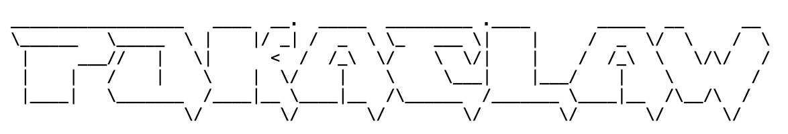
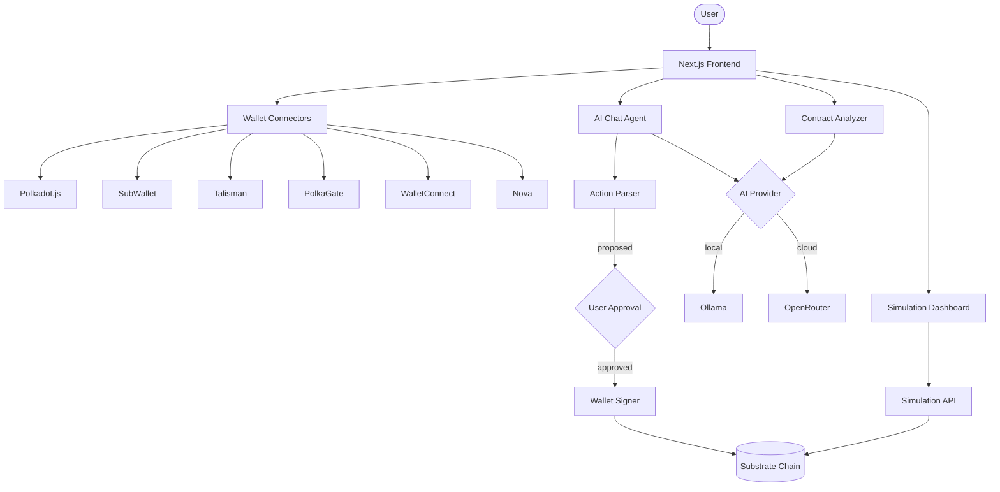
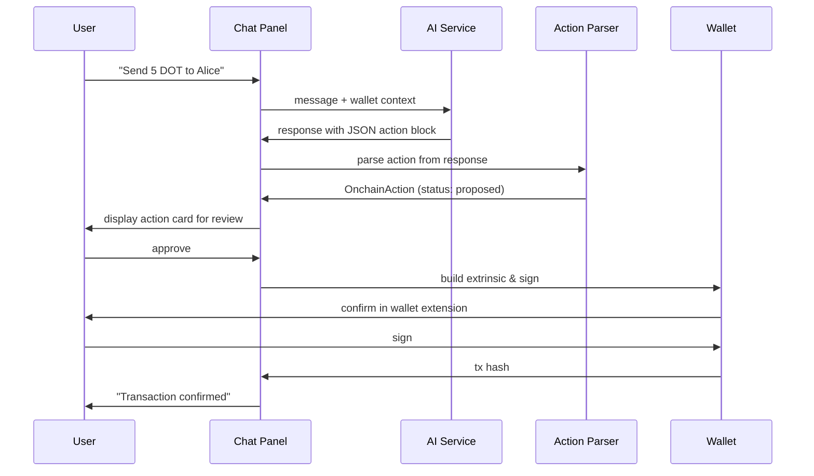
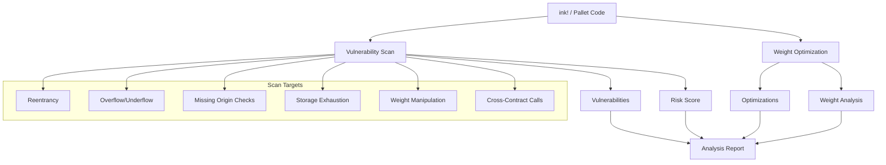
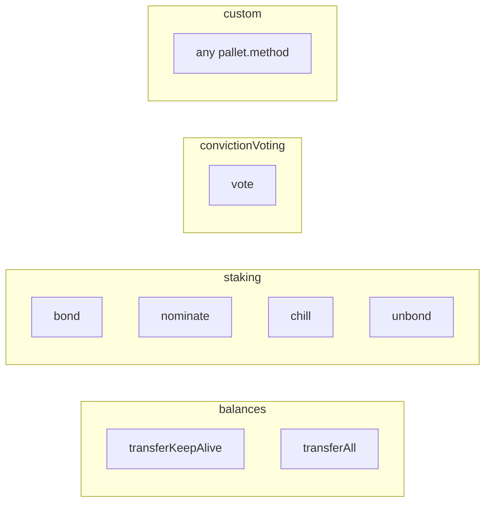

<p align="center">
  
</p>

Private AI agent for trusted onchain actions on Polkadot. Connect your wallet, tell it what to do in natural language, review the proposed action, approve and sign. AI runs locally or through OpenRouter.

## Architecture



## Agent Flow



## Simulation Dashboard

Dry-run any extrinsic against the live chain without submitting. Define pallet, method, and args — the simulator estimates weight and reports success/failure. Supports batching multiple extrinsics in sequential or parallel mode.

```mermaid
graph LR
    User[User Input] -->|"pallet / method / args"| Form[Extrinsic Builder]
    Form -->|"1..N extrinsics"| API[/api/chain/simulate]
    API --> Client[PolkadotAgentClient.dryRun]
    Client -->|parallel=false| Seq[Sequential]
    Client -->|parallel=true| Par[Promise.all]
    Seq --> Weight[Weight Estimation]
    Par --> Weight
    Weight --> QI[transactionPaymentApi.queryInfo]
    QI -->|"runtime trap / fallback"| PI[tx.paymentInfo]
    Weight --> Results[BatchSimulationResult]
    Results --> Metrics[Success Rate / Avg Weight / Duration]
```

## Contract Analysis



## Supported Actions



## Networks

| Network  | Token | Endpoint                          | Planck/Token       |
|----------|-------|-----------------------------------|--------------------|
| Polkadot | DOT   | `wss://rpc.polkadot.io`          | 10,000,000,000     |
| Kusama   | KSM   | `wss://kusama-rpc.polkadot.io`   | 1,000,000,000,000  |
| Westend  | WND   | `wss://westend-rpc.polkadot.io`  | 1,000,000,000,000  |

## Project Structure

```
app/
  page.tsx                    # landing page
  agent/page.tsx              # AI chat + action approval
  dashboard/page.tsx          # simulation dashboard
  providers.tsx               # LunoKit wallet config
  api/
    ai/chat/route.ts          # chat endpoint
    ai/analyze/route.ts       # contract analysis endpoint
    ai/health/route.ts        # health check
    chain/info/route.ts       # chain info endpoint
    chain/simulate/route.ts   # extrinsic simulation endpoint
lib/polkadot-agent/
  client.ts                   # PolkadotAgentClient (connect, query, simulate)
  ai-service.ts               # Ollama + OpenRouter providers
  get-ai-service.ts           # AI provider factory
  actions.ts                  # action parsing from AI responses
  prompts.ts                  # system prompts for security audit, optimization, chat
  simulation.ts               # SubstrateSimulationBuilder
  transaction.ts              # ExtrinsicBuilder
  types.ts                    # TypeScript types
```

## Setup

```bash
pnpm install
cp .env.example .env
```

Edit `.env`:

```env
# Required for WalletConnect/Nova connectors (get from cloud.walletconnect.com)
NEXT_PUBLIC_WALLET_CONNECT_ID=your_project_id

# RPC endpoint
SUBSTRATE_WS_ENDPOINT=wss://westend-rpc.polkadot.io

# AI provider: "ollama" or "openrouter"
AI_PROVIDER=ollama

# Ollama (local)
OLLAMA_URL=http://localhost:11434
OLLAMA_MODEL=qwen2.5-coder:14b

# OpenRouter (cloud)
OPENROUTER_API_KEY=your_key
OPENROUTER_MODEL=anthropic/claude-sonnet-4
```

```bash
pnpm dev
```

## Stack

- Next.js 15 (App Router)
- @polkadot/api
- @luno-kit/react + @luno-kit/ui (wallet connectivity)
- Ollama or OpenRouter (AI)
- Tailwind CSS 4
- Framer Motion
